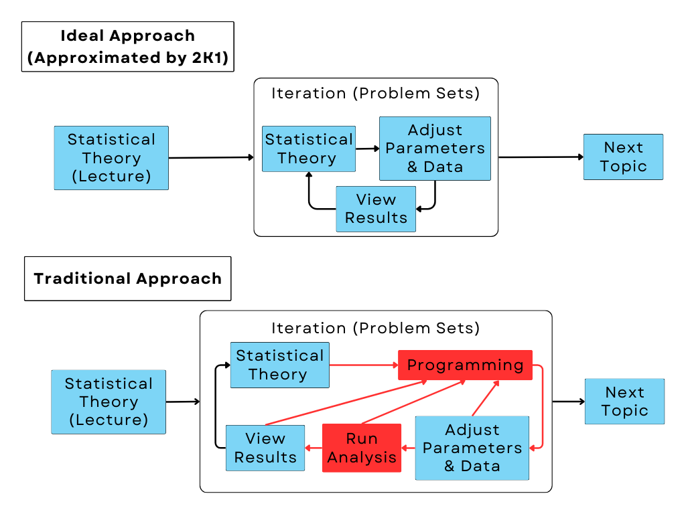

<h3 style="color:#9A2B35;">More Information</h4>

 Mastering statistical concepts requires repeated practice, but learning to code in R often diverts attention from the statistics itself. 2K1 simplifies this process, letting students focus on the material without needing coding skills. After lectures and readings, students can use 2K1 to generate data, explore how different choices affect outcomes, estimate models based on the data, and calculate key measures of interest. This approach allows for a deeper understanding of statistics in real-world contexts while keeping both the details and the big picture in view. 

&#9656; Overview

Learning while doing -- controlling inputs and watching how outputs change -- tends to be more helpful than static textbooks.  However, programming lessons can interrupt learning (for the same reason as you probably don't take swimming lessons during calculus class, even if you need to learn both skills). We also provide extensive and automated in-context assistance if, when, and where you need it (simply click on the little tooltips marked <b>i</b> whenever needed).

 Please see our paper “<a target="_blank" href="https://garyking.org/2k1">Statistical Intuition Without Coding (or Teachers)</a>”. The ideas here parallel some of the core, model-based content of <a target="_blank" href="https://projects.iq.harvard.edu/gov2001/">Gov 2001</a>, a key course in the Harvard Government Department's social science methods sequence (taught for many years by <a target="_blank" href="http://garyking.org">Gary King</a>). All the lectures, videos, and many other teaching materials are available for other instructors and students to use in their courses as well from the course website, <a target="_blank" href="https://projects.iq.harvard.edu/gov2001/">j.mp/G2001</a>, many parts of which are linked to in the tooltips in the app. (Thanks to generations of Gov2001 students and teaching fellows for helping us improve the ideas reflected here.) <a target="_blank" href="https://youtu.be/qs2uCuDL2OQ?t=2416">This lecture video</a> gives an overview of the course.

To learn more about 2K1-in-Silico, to send comments or suggestions, or to contribute to this open source package, see the <a target="_blank"  href = "https://iqss-research.github.io/2k1-in-silico/">app's website</a> and <a target="_blank" href="https://github.com/iqss-research/2k1-in-silico">GitHub repository</a>.

&#9656; Teaching and Learning with 2K1

&#9656; Math Documentation

To learn more about the math behind 2K1-in-Silico, see the <a target="_blank"  href = "https://docs.google.com/document/d/1tpIl1o8iZB6jQKyyOAEGQLIfs-wRY2lYGte7qJ9ylYE">math documentation</a>.

&#9656; X Values

To learn more about our covariates, see the <a target="_blank"  href = "https://docs.google.com/spreadsheets/d/1iLBqVaGuLxXyPF4LfuggeGfTZC2roSSaF-cnqSD7TEU">X Values documentation</a>.

&#9656; Substantive Application Examples

To see substantive applications for various DGP models, see  <a target="_blank"  href = "https://docs.google.com/document/d/1DcXcm2Zznjo5CfWvXahvW5ZvhARvvG3E6yPU4IcQUmU">our list of examples</a>.

&#9656; Technical Lesson Plans

If you are an instructor, you may find our <a target="_blank"  href = "https://docs.google.com/document/d/1wC6jN7OG4iyLVpoqZcVFCxeTPxqcipZjiDDWG1v1XQ0">Technical Lesson Plans</a> helpful starting points.

&#9656; Additional Interactive Statistical Apps

To see a list of additional resources that follow similar principles, see our <a target="_blank"  href = "https://docs.google.com/document/d/1_C8DjKmwCCah1bKjeNeS3ZOdnJNsTAEXK34h6qxeZ2I">list of more apps</a>.

&#9656; Local R Install

Install the app locally as an R package:
   <ul style="padding-left: 40px">
      <li><a href = "https://www.r-project.org/">Install R</a> (optionally <a href = "https://www.rstudio.com/products/rstudio/download/">with RStudio</a>) on your computer.</li>
      <li>Open a new R session, with no packages loaded.</li>
      <li>Make sure your R is at version 4.0.0 or later.</li>
      <li>Enter: <code>options(pkgType="binary")</code>.</li>
      <li>Install the <code>devtools</code> library: <code>install.packages("devtools")</code>. </li>
      <li>Install the package locally with <code>devtools::install_github(“iqss-research/2k1-in-silico”, upgrade = T, quiet = T)</code>, downloading dependencies as needed </li>
      <li>Load the package with <code>library("Gov2k1inSilico")</code>. </li>
      <li>Run the app with <code>runGov2k1()</code>.</li>
   </ul>

